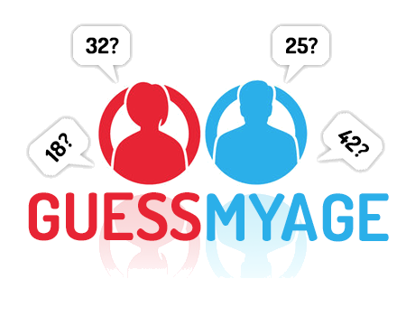

# Guess My Age
  
Follow the instructions of Alexa and she will guess your age!

Guess my age is a small gag Alexa skill that asks you to perform some calculations with the digits of your age. When you tell the final figure of your calculations, it will tell your age in years.

## Installation

The repo follows the structure of Amazon Alexa sample skills and should be installed the same way as described there: [https://github.com/alexa/skill-sample-nodejs-fact](https://github.com/alexa/skill-sample-nodejs-fact).

